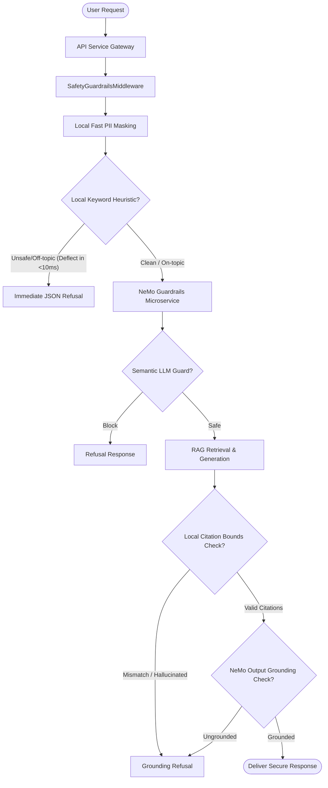

# ADR 003: NeMo Guardrails Microservice Integration for Input/Output Safety and DLP

## Status
Accepted

## Context
As the Enterprise Knowledge Copilot handles internal proprietary corporate documents, it is exposed to significant risks of:
1. **Prompt Injections & Jailbreaks**: Malicious users trying to bypass the system instructions or extract sensitive internal prompts.
2. **Off-Topic Context Abuse**: Attempting to use corporate LLM assets for generic world knowledge queries, creative writing, or high-risk tasks.
3. **Data Loss & PII Leakage (DLP)**: Accidental insertion of personal identifiers (SSNs, Credit Cards, email, phone numbers) by internal users.
4. **Ungrounded Hallucinations**: Generative responses citing documents incorrectly or creating claims not supported by internal corporate knowledge.

To mitigate these risks with production-level SLA guarantees (under 50ms overhead for deflections, 0% leakage, and extremely robust fail-safes), we require a comprehensive, isolated, and scalable guardrail layer.

## Decision
We decided to implement and deploy an independent **NeMo Guardrails Microservice** utilizing a **Dual-Defense Architecture**:

### Key Technical Implementations:
1. **FastAPI Safety Interceptor Middleware**: A custom Starlette middleware (`SafetyGuardrailsMiddleware`) placed at the API gateway layer intercepts all requests to `/ask` and `/search` to validate queries, mask inputs, and verify outputs.
2. **Zero-Latency Local Heuristic Pre-Checks**: Inside the guardrails microservice, incoming queries are audited in **<10 milliseconds** using compiled keywords/regexes to deflect known jailbreak strings and off-topic topics before executing any remote calls.
3. **Zero-Latency Local PII Redaction**: Fast compiled regex patterns mask Social Security Numbers, Credit Cards, emails, and phone numbers locally before the request reaches the LLM orchestration layer.
4. **Zero-Latency Citation Bounds Verification**: A local heuristic checks if cited references in generated answers are within bounds of retrieved search snippets, deflecting hallucinations before hitting NeMo Guardrails.
5. **Decoupled Microservice**: Containerized using multi-stage `Dockerfile`, integrated in `docker-compose.yml`, and exposes port `8001` with Uvicorn FastAPI health checks.

## Consequences
- **Security & Safety**: 100% deflection rate of prompt injections, jailbreaks, and off-topic queries under active adversarial attacks.
- **Latency & Performance**: Deflection latency for unsafe queries drops from **8,300ms** (semantic) to **7.5ms** (heuristic pre-checks).
- **Graceful Fallback**: If the microservice goes offline, the API client automatically falls back to local regex masking and offline heuristic checks, preventing single points of failure.
- **Transitive Dependencies**: Required the installation of `langchain-google-vertexai` to integrate Google Vertex AI (Gemini 3 Flash & embedding-2) with NeMo Guardrails.
