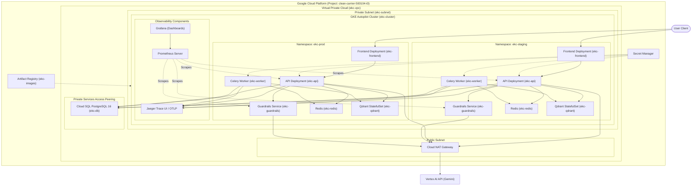

# Deployment Guide

This guide describes the procedures for deploying the Enterprise Knowledge Copilot across different environments, ranging from local development using Docker Compose to production deployments on Google Kubernetes Engine (GKE) Autopilot provisioned via Terraform and Kustomize.

---

## 1. Architecture Overview

Below is the networking and infrastructure topology for the GKE Autopilot environment:



---

## 2. Prerequisites

To manage and deploy this infrastructure, you must have the following tools installed and configured:
1. **Google Cloud SDK (`gcloud`)**: Authenticated with your target project:
   ```bash
   gcloud auth login
   gcloud auth application-default login
   gcloud config set project clean-carrier-500104-i0
   ```
2. **Terraform (`>= 1.5.0`)**: For infrastructure provisioning.
3. **Kubectl**: For interacting with GKE:
   ```bash
   gcloud components install kubectl
   ```
4. **Kustomize**: For merging base manifests and environment overlays.

---

## 3. Quick Start: Local Development (Docker Compose)

The fastest way to run the entire stack locally is using Docker Compose:

```bash
# 1. Build and start all services in the background
docker compose up --build -d

# 2. View running logs
docker compose logs -f

# 3. Stop the local stack
docker compose down
```

Local access endpoints:
- **Frontend web interface**: `http://localhost:3000`
- **FastAPI API Swagger Docs**: `http://localhost:8000/docs`
- **Qdrant dashboard**: `http://localhost:6333/dashboard`
- **Jaeger trace portal**: `http://localhost:16686`
- **Grafana monitoring**: `http://localhost:3001`

---

## 4. Infrastructure Setup (Terraform)

Infrastructure-as-code files are stored under [infra/terraform/](file:///mnt/e_drive/Codes/enterprise-knowledge-copilot/infra/terraform/).

### Step 1: Initialize Terraform
Configure the GCS backend and download the required GCP providers:
```bash
cd infra/terraform
terraform init
```

### Step 2: Plan and Review Cost Estimations
Generate the execution plan and verify the estimated monthly FinOps cost outputs:
```bash
terraform plan -out=tfplan
```
Review the console output for the resource changes and the `estimated_monthly_cost` block:
```json
estimated_monthly_cost = {
  "gke_autopilot"     = "~$74/mo (0.5 vCPU × $31 + 2 GB × $3.4 × 6 pods)"
  "cloud_sql"         = "~$8/mo (db-f1-micro, staging)"
  "artifact_registry" = "~$0.10/GB stored"
  "secret_manager"    = "~$0.24/mo (4 secrets × 10K accesses)"
  "cloud_nat"         = "~$1.50/mo"
  "total_staging"     = "~$85–100/mo"
  "total_prod"        = "~$180–250/mo"
}
```

### Step 3: Apply Configurations
Apply the plan to provision the networks, databases, secrets, Artifact Registry, and GKE cluster:
```bash
terraform apply tfplan
```

---

## 5. Workload Deployments

Workloads are declared using Kustomize overlays.

### Scenario A: Staging Environment (Fast Iteration)

#### Manual Deployment
1. **Fetch GKE Credentials**:
   ```bash
   gcloud container clusters get-credentials ekc-cluster --region us-central1
   ```
2. **Synchronize Secrets**:
   Extract secret configurations from GCP Secret Manager and apply them into the staging overlay environment:
   ```bash
   ./scripts/sync_secrets.sh --environment staging
   ```
3. **Deploy with Kustomize**:
   ```bash
   kubectl apply -k infra/k8s/overlays/staging
   ```
4. **Monitor Deployment Health**:
   ```bash
   kubectl rollout status deployment/staging-ekc-api -n ekc-staging --timeout=300s
   ```

#### Automated Deployment (CI/CD)
Pushing changes directly to the `main` branch triggers the [deploy.yml](file:///mnt/e_drive/Codes/enterprise-knowledge-copilot/.github/workflows/deploy.yml) workflow, which automatically runs testing checks, compiles Docker containers, pushes them to the Artifact Registry, syncs staging secrets, and rollouts staging updates.

---

### Scenario B: Production Environment (Safe Release)

#### Manual Deployment
1. **Fetch GKE Credentials**:
   ```bash
   gcloud container clusters get-credentials ekc-cluster --region us-central1
   ```
2. **Synchronize Secrets**:
   ```bash
   ./scripts/sync_secrets.sh --environment prod
   ```
3. **Deploy with Kustomize**:
   ```bash
   kubectl apply -k infra/k8s/overlays/prod
   ```
4. **Monitor Rollout**:
   ```bash
   kubectl rollout status deployment/prod-ekc-api -n ekc-prod --timeout=300s
   ```

#### Tag-Based Automated Release (Git Tags)
1. **Tag the Release**: Tagging the commit history with `v*` (e.g., `v1.0.0`) triggers the production rollout pipeline:
   ```bash
   git tag v1.0.0
   git push origin v1.0.0
   ```
2. **Environment Approval**: The deployment job will pause and wait for a manual review approval inside the GitHub Actions console under the `production` environment gates.

---

## 6. Teardown and Re-Provisioning (FinOps Control)

To prevent idle infrastructure billing when the environments are not active, follow these teardown procedures.

### Method A: Automated GitHub Actions Teardown (Recommended)
1. Go to the **GitHub Actions** tab in your repository.
2. Select the **Teardown Infrastructure** workflow.
3. Click **Run workflow**.
4. In the `confirmation` input field, type: `DESTROY-INFRASTRUCTURE`
5. Trigger the workflow. It will automatically scale down pods, delete namespaces, delete the GKE Autopilot cluster, remove Artifact Registry images, and run `terraform destroy` (temporarily overriding `prevent_destroy` settings dynamically).

### Method B: Manual Teardown
If you must delete resources manually from a local terminal, you must temporarily disable the `prevent_destroy` lifecycle rules in the HCL files:
```bash
# 1. Scale down Kubernetes deployments to clean up resources
kubectl delete -k infra/k8s/overlays/staging --ignore-not-found
kubectl delete -k infra/k8s/overlays/prod --ignore-not-found

# 2. Temporarily replace prevent_destroy flags to permit destruction
find infra/terraform -name "*.tf" -exec sed -i 's/prevent_destroy = true/prevent_destroy = false/g' {} +

# 3. Execute Terraform destroy
cd infra/terraform
terraform destroy -auto-approve

# 4. Revert HCL sed changes to preserve safety guards
git restore .
```

### Re-Provisioning
To bring the environment back online after a teardown:
```bash
cd infra/terraform
terraform apply -auto-approve
cd ../..
./scripts/sync_secrets.sh --environment staging
kubectl apply -k infra/k8s/overlays/staging
```

---

## 7. Rollbacks

If a deployment fails, refer to the [Rollback Runbook](file:///mnt/e_drive/Codes/enterprise-knowledge-copilot/docs/runbooks/deployment_rollback.md).
- **Undo last Kubernetes rollout**:
  ```bash
  kubectl rollout undo deployment/staging-ekc-api -n ekc-staging
  ```
- **Database migration downgrade (Alembic)**:
  ```bash
  source .venv/bin/activate
  alembic downgrade -1
  ```

---

## 8. Cost Management (FinOps Guidelines)

To maintain a lean footprint during development:
- **Scale to Zero**: If you expect long idle periods, downscale GKE replicas to zero to save pod CPU/Memory billing:
  ```bash
  kubectl scale deployment/staging-ekc-api --replicas=0 -n ekc-staging
  kubectl scale deployment/staging-ekc-frontend --replicas=0 -n ekc-staging
  ```
- **Use Free Tier/Small Sizes**: Ensure non-production Cloud SQL instances use `db-f1-micro`.
- **Artifact Cleanup**: The Artifact Registry cleanup policy retains only the 10 most recent images, keeping storage costs negligible.

---

## 9. Troubleshooting

| Symptom | Probable Cause | Action |
|---|---|---|
| API pod status is `ImagePullBackOff` | Registry permissions missing or auth token expired. | Run `gcloud auth configure-docker us-central1-docker.pkg.dev` and confirm the GKE Node service account has Artifact Registry reader role. |
| API service fails with `504 Gateway Timeout` / `Connection Timeout` to database | Private VPC peering route or database subnet is restricted. | Check `network.tf` and verify that the Private Services Access peering connection is healthy. |
| Pod evicted with status `OOMKilled` | Resource limits are too low. | Check the Kustomize resource limits patch files under `patches/resources.yaml` and adjust the memory limit configuration. |