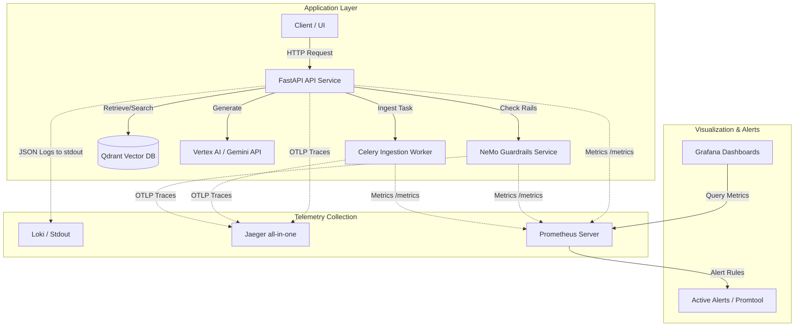

# Observability Guide

This document describes the observability stack, metrics, traces, structured logging configuration, dashboards, and alerting architecture.

---

## Architecture Overview

---

## Centralized Configurations

- **Metrics Exporter**: OpenTelemetry Metrics SDK configured via `packages/observability/metrics.py`. FastAPI auto-instruments via `FastAPIInstrumentor` and routes Prometheus queries through the ASGI app mounted under `/metrics`.
- **Distributed Tracing**: OpenTelemetry Tracing SDK configured via `packages/observability/tracing.py` sending OTLP gRPC data to Jaeger on port `4317`.
- **Structured Logging**: `structlog` configured in `packages/observability/logging.py` outputting ISO 8601 timestamps, trace correlation IDs, and JSON-formatted logs to standard output.

---

## Grafana Dashboards

Grafana is available at `http://localhost:3001` (Credentials: `admin`/`admin`). The following dashboards are auto-provisioned:

1. **Request Health (`01-request-health.json`)**: Tracks API Request volume, latency (P50, P95, P99), error rates by endpoint, and concurrent active requests.
2. **Retrieval Performance (`02-retrieval-performance.json`)**: Tracks search queries by method (dense, sparse, hybrid), recall metrics, collection latency, and cross-encoder reranking time.
3. **Generation Performance (`03-generation-performance.json`)**: Monitors LLM response latency, cache hit/miss ratio, input/output token counts, and estimated cost per hour in USD.
4. **Safety (`04-safety.json`)**: Tracks NeMo input/output rail verification latency, block rate by category (jailbreak, off-topic, PII, hallucination), and safety checks throughput.
5. **System Failures (`05-system-failures.json`)**: Displays system-wide exceptions, timeout patterns, Celery ingestion task retries/failures, and individual service uptime gauges.

---

## Querying Metrics in Prometheus

Prometheus is available at `http://localhost:9090`. Key query metrics include:

- `http_server_request_duration_seconds_bucket`: Quantile analysis of API endpoints.
- `system_failure_total`: Counter tracking exceptions by component and error classification.
- `system_timeout_total`: Count of service timeouts.
- `llm_cache_hit_total`: Tracks responses served from cache (`hit="true"`) vs generated fresh (`hit="false"`).
- `llm_circuit_breaker_state`: Gauge indicating circuit state (0=CLOSED, 1=HALF_OPEN, 2=OPEN).

---

## Distributed Tracing in Jaeger

Jaeger UI is accessible at `http://localhost:16686`. 
Traces span from the FastAPI request handler down through the entire pipeline:
1. `api.ask` or `api.search` (parent span)
2. `safety.input_validation` (NeMo check)
3. `orchestrator.answer_query`
4. `retrieval.embed_query` / `retrieval.qdrant_query`
5. `reranking.score`
6. `generation.build_prompt` / `generation.llm_call`
7. `safety.output_validation` (Fact check / Grounding)

To check for bottlenecks, inspect the duration of children spans relative to the parent request span.

---

## Operational Runbooks Index

For any active alert triggered in Prometheus, refer to the corresponding operational runbook:

- [High P95 Latency Runbook](file:///mnt/e_drive/Codes/enterprise-knowledge-copilot/docs/runbooks/high_p95_latency.md)
- [Circuit Breaker Open Runbook](file:///mnt/e_drive/Codes/enterprise-knowledge-copilot/docs/runbooks/circuit_breaker_open.md)
- [Ingestion Failure Runbook](file:///mnt/e_drive/Codes/enterprise-knowledge-copilot/docs/runbooks/ingestion_failures.md)
- [Vector DB Connectivity Runbook](file:///mnt/e_drive/Codes/enterprise-knowledge-copilot/docs/runbooks/vector_db_connectivity.md)
- [Safety Block Spike Runbook](file:///mnt/e_drive/Codes/enterprise-knowledge-copilot/docs/runbooks/safety_block_spike.md)

---

## Phase 10 Roadmap

The following cloud-based observability components will be configured in the next phase:
- **Loki Log Aggregation**: Deploying Promtail/Alloy alongside Grafana Loki to aggregate the JSON stdout logs from all cluster workloads.
- **Jaeger Persistence**: Migrating Jaeger from ephemeral in-memory storage to a Badger or Elasticsearch backend.
- **Alertmanager Routing**: Configuring Prometheus Alertmanager to route Critical alerts to PagerDuty/Slack, and Warnings to email/triage channels.
- **Scrape Authentication**: Adding API key or network-isolated authentication to `/metrics` endpoints.